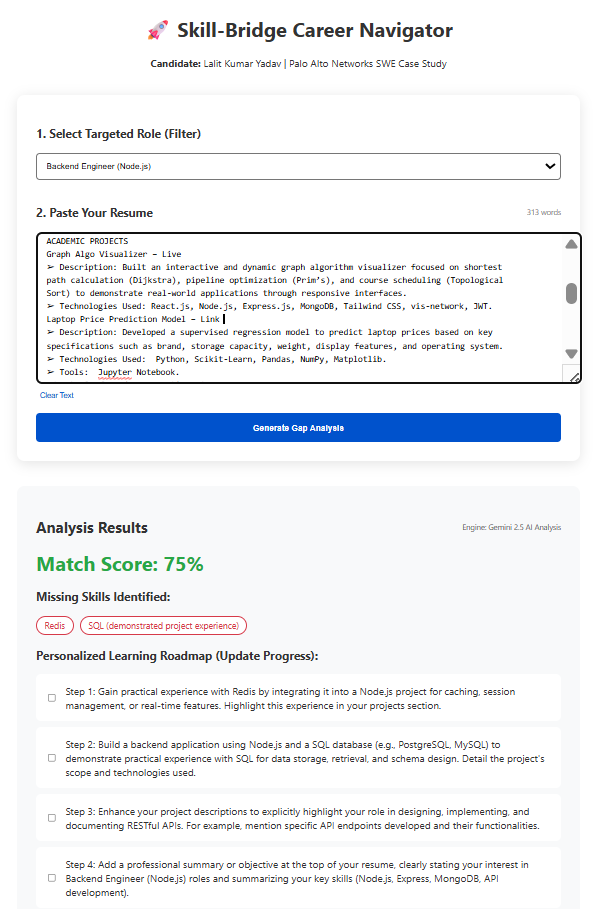

# 🚀 Skill-Bridge Career Navigator
**Candidate:** Lalit Kumar Yadav (Delhi Technological University)  
**Case Study:** Palo Alto Networks FY26 IT Hiring Challenge

---

## 📸 Application Preview

---

## 📺 Project Submission Links
| Resource | Link |
| :--- | :--- |
| **Video Presentation** | [▶️ Watch the 5-7 Minute Demo on YouTube](PASTE_YOUR_YOUTUBE_LINK_HERE) |
| **Design Documentation** | [📄 View Technical Design Documentation](./DESIGN.md) |

---

## 📌 Project Overview
> **The Problem:** Students and career-switchers often face a "Black Box" when applying for specialized roles. They may have the core skills but miss the specific "last-mile" technical requirements that lead to successful placements.

**The Solution:** `Skill-Bridge` is an AI-powered navigator that performs a deep-tissue gap analysis on a user’s resume. By comparing real-world resume text against specific industry-standard job descriptions using **Gemini 2.5-Flash**, it generates a personalized, actionable roadmap to bridge those gaps.

---

## 🛠️ Technical Stack
| Layer | Technologies |
| :--- | :--- |
| **Frontend** | React 18 (Vite), Axios, CSS3 (Modular & Responsive UI) |
| **Backend** | Node.js, Express.js |
| **AI Engine** | Google Gemini 2.5-Flash (via Google AI Studio) |
| **Testing** | Jest, Supertest (Focusing on Edge Cases & Resilience) |
| **Security** | Environment-based configuration (`dotenv`) |

---

## 🧠 Core Engineering Pillars (Design Choices)

### 1. High-Availability & Resilient Fallback
In alignment with Palo Alto Networks' focus on **stable infrastructure**, I implemented a "Graceful Degradation" strategy:
* **Primary Engine:** Real-time NLP analysis via Gemini 2.5-Flash for creative, context-aware roadmaps.
* **Fallback Engine:** If the AI API experiences latency or failures, a server-side **Deterministic Keyword Matcher** automatically takes over. This ensures the user *always* receives a functional gap analysis.

### 2. Full-Stack CRUD Lifecycle
I ensured the application satisfies the core requirements of a functional MVP:
* **Create:** Generate new analysis reports from resume input.
* **View:** Real-time rendering of Match Scores and Skill Gaps.
* **Update:** An interactive **Roadmap Progress Tracker**. Users can "Check off" steps, which updates the application state—providing a tangible sense of progress.
* **Filter:** A job library allows users to switch between different career paths instantly.

### 3. Technical Rigor & Quality Assurance
The codebase is hardened with automated unit tests to ensure reliability:
* **Happy Path:** Confirms successful score generation for valid data.
* **Edge Case 1:** Validates 400-level error handling for empty/missing inputs.
* **Edge Case 2:** Validates 404-level error handling for invalid Job IDs.

---

## ⚖️ Responsible AI & Security
* **Data Privacy:** Resume data is processed as a transient stream. No personal user data is stored or used for model training, adhering to strict privacy-first principles.
* **Transparency:** The UI explicitly labels when the analysis is generated via "AI Analysis" versus the "Fallback Engine," ensuring user trust.
* **Security Hygiene:** Sensitive API credentials are never hardcoded; they are managed through `.env` files with a provided `.env.example` template for reviewers.

---

## 📉 Engineering Tradeoffs
* **Text-Paste vs. PDF Parsing:** I chose a text-input method to prioritize **Data Integrity**. PDF layouts often introduce parsing "noise" that can lead to AI hallucinations. Text-paste ensures the AI receives 100% clean data for the most accurate gap analysis.
* **MERN-Lite Architecture:** I utilized a local `jobs.json` database instead of a full MongoDB deployment to maximize velocity and focus on **AI Resilience** and **Testing**, which were higher-weighted criteria for this specific case study.

---

## 🔮 Future Enhancements
* **Persistence Layer:** Integrating a database to allow users to save multiple resumes and track progress over time.
* **Live Job Scraping:** Connecting to LinkedIn or Glassdoor APIs for real-time job postings.
* **Advanced AI Guardrails:** Implementing a secondary LLM "check" to further minimize hallucinations in technical roadmap steps.

---

## 🚀 Getting Started

### Prerequisites
* **Node.js** v20.14.0 or higher.
* **Gemini API Key** (Google AI Studio).
🚀 Installation & Setup
Follow these steps to get the Skill-Bridge Navigator running on your local machine.

1. Clone the Repository
git clone https://github.com/Lalit-Kumar-Yadav-DTU/skill-bridge-navigator
cd skill-bridge-navigator

3. Backend Configuration
cd server
npm install
cp .env.example .env  # IMPORTANT: Add your GEMINI_API_KEY to this file
node index.js

5. Frontend Configuration
cd ../client
npm install
npm run dev

7. Running Automated Tests
cd server
npm test
